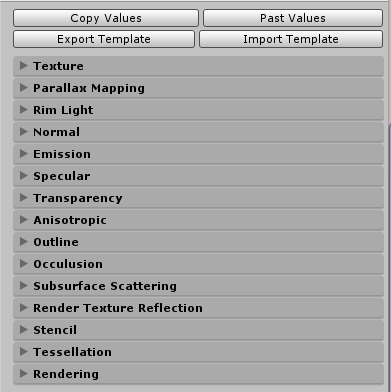
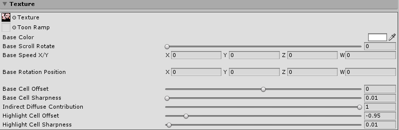
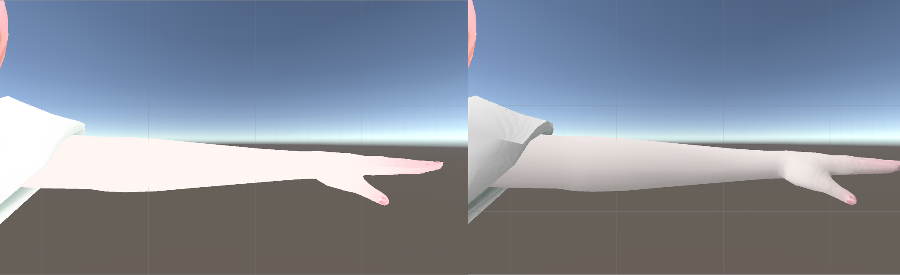
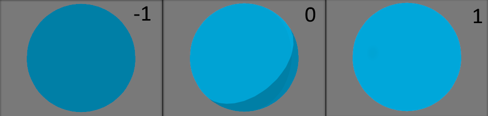
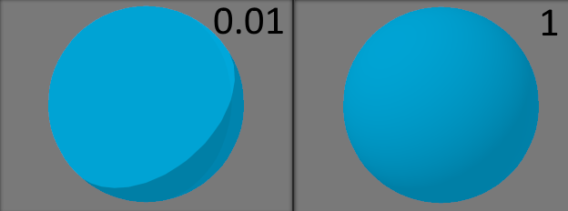
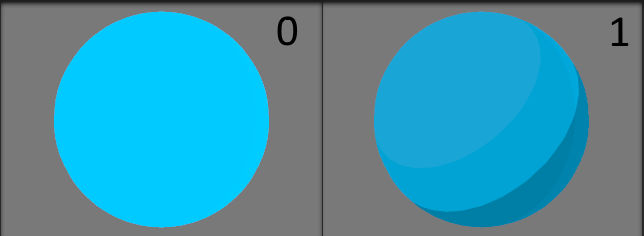
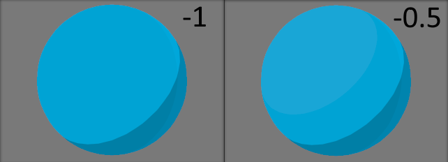
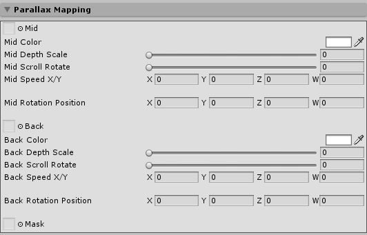
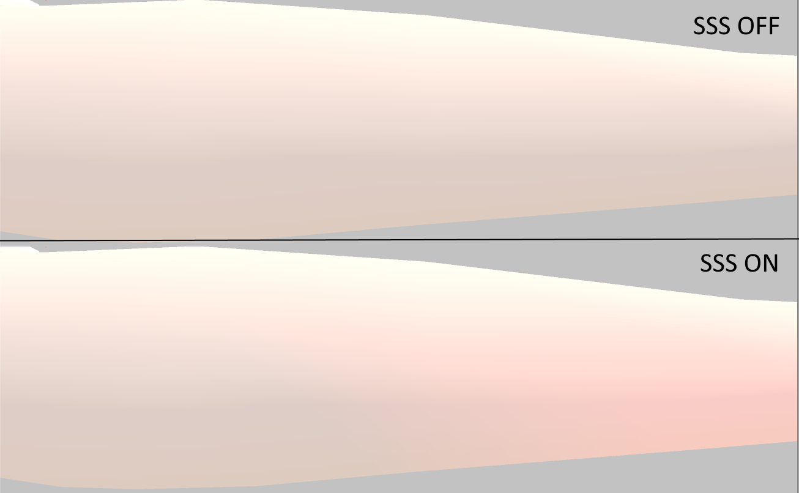

# Isuzu Shaders

## パラメーター

### Texture

#### Texture

属性 : NoScaleOffset

**Texture**はマテリアル全体のテクスチャを設定します。

メッシュに表示させたいテクスチャを指定してください。

#### Toon Ramp

> 左端が黒く、右端に行くにつれて白になっているテクスチャを設定した場合のイメージ。
> 光が当たっている部分が白く、影の部分が黒くなっている。

属性 : NoScaleOffset

**Toon Ramp**はトゥーンシェーディングによる明るい部分と暗い部分(影)の色を変更するためのテクスチャを設定します。

右側が明るい部分で、左側が暗い部分のグラデーションで表されます。

#### Base Color

属性 :

**Base Color**はVector3(RGB)値を受け取り、Textureに乗算されます。

**Texture**の画像の色を調整する際に使用してください。

#### Base Scroll/Rotate

属性 : Range(0 - 1)

**Texture**のUVに対してのスクロールと回転を切り替えます。

**0**でスクロール・**1**で回転です。

#### Base Speed(X/Y)

属性 :

スクロール時と回転時で以下の効果です。

スクロール(X/Yのみ使用) : それぞれの方向に対してのスクロール速度

回転(Xのみ使用) : 回転速度

#### Base Rotation Position

属性 :

回転させる中心位置を指定します。(x, y)(0.5, 0.5)が中心です。

#### Base Cell Offset

属性 : Range(-1 - 1)

**Base Cell Offset**は影のつく割合を-1から1の間で調整することができます。

**-1**で完全に暗く、**1**で完全に明るくなります。

#### Base Cell Sharpness

属性 : Range(0.01 - 1)

**Base Cell Sharpness**は明暗の境界部分のぼやけ方を0.01から1の間で調整することができます。

**0.01**で境界がはっきりと、**1**で境界がほぼ無いように見えます。

#### Indirect Diffuse Contribution

属性 : Range(0 - 1)

**Indirect Diffuse Contribution**はライティングを行うか否かの設定を行えます。

**0**でUnlitのような、**1**でライティング結果を表します。

#### Highlight Cell Offset

属性 : Range(-1 - -0.5)

**Highlight Cell Offset**は明るい部分に更に明るい部分(ハイライト)を追加します。

**-1**では追加されず、**-0.5**になるにつれて範囲が広がります。

#### Highlight Cell Sharpness

属性 : Range(0 - 1)

~~**Highlight Cell Sharpness**はハイライトの境界部分のぼやけ方を0から1の間で調整することができます。

**0.01**で境界がはっきりと、**1**で境界がほぼ無いように見えます。~~(調整中)

1にすることでAnisotropicが動作します。

#### Shadow Contribution

属性 : Range(0 - 1)

**Shadow Contribution**は影部分の明暗を0から1の間で調整することができます。

**0**で影がはっきりと、**1**で影がほぼ無いように見えます。

### Parallax Mapping

視差マッピング・インテリアマッピング等で使用されている、視差を利用した立体感を出すための手法。

#### Mid

属性 : NoScaleOffset

**Mid**は3段階ある奥行きのうち、中間に位置する物を表すテクスチャを設定します。

#### Mid Color

属性 : HDR

**Mid Color**はVector3(RGB)値を受け取り、Midに乗算されます。

**Mid**の画像の色を調整する際に使用してください。

#### Mid Depth Scale

属性 : Range(0 - 1)

**Mid Depth Scale**は位置を指定することが出来ます。

**0**で最前面、**1**に近づくにつれて奥にあるように見えます。

#### Mid Scroll/Rotate

属性 : Range(0 - 1)

**Mid**のUVに対してのスクロールと回転を切り替えます。

**0**でスクロール・**1**で回転です。

#### Mid Speed(X/Y)

属性 :

スクロール時と回転時で以下の効果です。

スクロール(X/Yのみ使用) : それぞれの方向に対してのスクロール速度
回転(Xのみ使用) : 回転速度

#### Mid Rotation Position

属性 :

回転させる中心位置を指定します。(x, y)(0.5, 0.5)が中心です。

#### Back

属性 : NoScaleOffset

**Back**は3段階ある奥行きのうち、中間に位置する物を表すテクスチャを設定します。

#### Back Color

属性 : HDR

**Back Color**はVector3(RGB)値を受け取り、Backに乗算されます。

**Back**の画像の色を調整する際に使用してください。

#### Back Depth Scale

属性 : Range(0 - 1)

**Back Depth Scale**は位置を指定することが出来ます。

**0**で最前面、**1**に近づくにつれて奥にあるように見えます。

#### Back Scroll/Rotate

属性 : Range(0 - 1)

**Back**のUVに対してのスクロールと回転を切り替えます。

**0**でスクロール・**1**で回転です。

#### Back Speed(X/Y)

属性 :

スクロール時と回転時で以下の効果です。
スクロール(X/Yのみ使用) : それぞれの方向に対してのスクロール速度
回転(Xのみ使用) : 回転速度

#### Back Rotation Position

属性 :

回転させる中心位置を指定します。(x, y)(0.5, 0.5)が中心です。

#### Mask

属性 : NoScaleOffset

**Mask**はParallax Mappingにおいて、最前面・中間面・最背面の3つのレイヤーを指定するためのマスク画像です。

**赤(R:255 G:0 B:0)**を最前面、**緑(R:0 G:255 B:0)**を中間面、**黒(R:0 G:0 B:0)**を最背面として塗りつぶされた画像を設定します。

### Rim Light

輪郭部分の露光をシミュレートします。

#### Rim Color

属性 :

**Rim Color**はVector3(RGB)値を受け取り、リムの色として使用します。

#### Rim Power

属性 : Range(0 - 1)

**Rim Power**はリムの強さを**0**から**1**で指定します。

#### Rim Offset

属性 : Range(0 - 1)

**Rim Offset**はリムの範囲を**0**から**1**で指定します。

#### Use Lim　　

属性 : Toggle

**Use Lim**はリムライトを使用するかどうかを指定します。

**Rim Power**・**Rim Offset**を**1**にした状態でも同じように見えますが、
使用しないのであれば切っておくほうが確実です。

### Normal

#### Normal

**Normal**は法線(ノーマル)マップテクスチャを受け取り、表面に立体感を与えます。

法線(ノーマル)マップがある場合、これを利用できます。

#### Normal Scale

**Normal Scale**は法線の強さを**0**から**1**で指定できます。

### Emission

自己発光の設定をします。

#### Emission Color

属性 :

**Rim Color**はVector3(RGB)値を受け取り、エミッションの色として使用します。

#### Emission Intensity

属性 : Range(0 - 1)

**Rim Power**はエミッションの強さを**0**から**1**で指定します。

#### Emission Mask

属性 : NoScaleOffset

**Texture**のどの部分を発光させるかを指定するマスク画像を指定できます。

発光させたい部分を白、その他を黒で指定してください。

### Specular

反射

#### Specular Map

属性 : NoScaleOffset

**Texture**のどの部分にスペキュラを適用させるかを指定するマスク画像を指定できます。

適用させたい部分を白、その他を黒で指定してください。

#### Specular Color

属性 :

**Specular Color**はVector3(RGB)値を受け取り、エミッションの色として使用します。

### Transparency

#### Mask Clip Value

属性 : Range(0 - 1)

**Mask Clip Value**はピクセルが不透明または透明になるときのしきい値を**0**から**1**で指定します。

#### Opacity

属性 : Range(0 - 1)

**Opacity**は透明度を**0**から**1**で指定します。

* 値 0 は完全に透明であることを意味します。
* 値 1 は完全に不透明であることを意味します。

### Anisotropic

アニソトロピック (異方性) スペキュラリティは、それを通る屈折と複数散乱を用いてサーフェスからの光の反射を近似します。

これは一般に髪の天使の輪と呼ばれる現象を再現します。

#### Anisotropy X

属性 : Range(0 - 1)

**Anisotropy X**はX方向への広がりを**0**から**1**で指定します。

#### Anisotropy Y

属性 : Range(0 - 1)

**Anisotropy X**はY方向への広がりを**0**から**1**で指定します。

#### Anisotropy X2

属性 : Range(0 - 1)

**Anisotropy X2**はX方向への広がりを**0**から**1**で指定します。

これは使用しなくてもよいですが、使用した場合2つ目のレイヤーとして加算されます。

#### Anisotropy Y2

属性 : Range(0 - 1)

**Anisotropy Y2**はY方向への広がりを**0**から**1**で指定します。

これは使用しなくてもよいですが、使用した場合2つ目のレイヤーとして加算されます。

#### Layer2 Blend Weight

属性 : Range(0 - 1)

**Layer2 Blend Weight**は2レイヤー目のAnisotropyの加算具合を**0**から**1**で指定します。

#### Use Anisotropic　　

属性 : Toggle

**Use Anisotropic**は、Anisotropicを使用するかを設定します。

### Outline

Vetexベースのアウトライン

#### Outline Tint

属性 :

**Outline Tint**はVector3(RGB)値を受け取り、アウトラインの色として使用します。

#### Outline Width

属性 : Range(0 - 0.2)

**Outline Width**はアウトラインの幅を**0**から**0.2**で指定します。

### Occulusion

アンビエントオクルージョン（AO）は、オクルージョンによる光の減衰を近似する効果です。

これは通常、標準的なグローバルイルミネーションに加えて、コーナー、隙間、またはその他の機能を暗くして、より自然でリアルな外観を作成する、微妙な効果として最もよく使用されます。

#### Occulusion Map

属性 : NoScaleOffset

**Occulusion Map**はマテリアルに適用させるAOマップを設定します。

#### Occulusion Strength

属性 : Range(0 - 10)

**Occulusion Strength**はAOの強さを**0**から**10**で指定します。

### Subsurface Scattering

ライトが表面の反対側からの光の一部が透けて見えることを可能にします。

表面下散乱（SSS）は、人間や他の生き物のために現実的な肌を作成するためによく使用されます。

ただし、このシェーディングモデルによる効果は、一般的にスキンレンダリングに使用されるものよりも低品質で安価です。

#### SSS Map

属性 : NoScaleOffset

**SSS Map**はマテリアルに適用させるSSSマップを設定します。

これは厚みを示すための値として使用され、白(1.0, 1.0, 1.0)に近づくほどその部分が薄いものとして扱われます。

#### SSS Color

属性 :

**SSS Color**はVector3(RGB)値を受け取り、透けた光の色として使用します。

例えば皮膚部分に赤を指定すると、表面下の血の色に見えます。

#### SSS Scale

属性 : Range(0 - 1)

**SSS Scale**はSSSの範囲を**0**から**1**で指定します。

#### SSS Power

属性 : Range(0 - 1)

**SSS Power**はSSSの強さを**0**から**1**で指定します。

#### Subsurface Distortion

属性 : Range(0 - 1)

**SSS Power**はSSSの濃さを**0**から**1**で指定します。

#### Use SSS

属性 : Toggle

**Use SSS**はSSSを使用するかどうかを指定します。
**SSS Power**・**SSS Offset**を**1**にした状態でも同じように見えますが、
使用しないのであれば切っておくほうが確実です。

### Render Texture Refrection

ただ単に、Render Textureを指定できるだけです。

#### Render Texture

属性 :

**Render Texture**はマテリアルに追加させるRender Textureを設定します。

#### Reflection Blend

属性 : Range(0 - 1)

**Reflection Blend**は**Render Texture**の加算度合いを**0**から**1**で指定します。

### Stencil

https://docs.unity3d.com/ja/500/Manual/SL-Stencil.html

### Tessellation

### Rendering

#### Cull Mode

属性 : Enum(Off, Front, Back)

**Cull Mode**はバックフェースカリングモードを指定します。

* Off   :両面描画
* Front :裏側描画
* Back  :表側描画

#### Static High Lights

#### Use Light Color

属性 : Toggle

**Use Light Color**はDirectionalLight・PointLightの色を受け取るかを指定します。

**0**で受け取らない、**1**で受け取ります。

ただし、**0**を選択した場合も、それぞれのライトの明るさは受け取ります。

またSSSなどは独立しているため、完全に色を受け取りたくない場合はそちらも確認してください。

#### Render Queue

#### Enable GPU Instancing

#### Double Sided Global Illumination

#### Global Illumination

## エディタ拡張機能

### Copy Values

そのマテリアルの設定値をコピーします。

### Past Values

**Copy Values**でコピーした値を、現在のマテリアルに上書きします。

### Export Template

そのマテリアルの設定値をファイルに出力します。

### Import Template

**Export Template**で出力されたマテリアルの設定値ファイルを読み込み、現在のマテリアルに上書きします。

デフォルトでは、Isuzu`s Shader/Templateフォルダにいくつか入っています。
